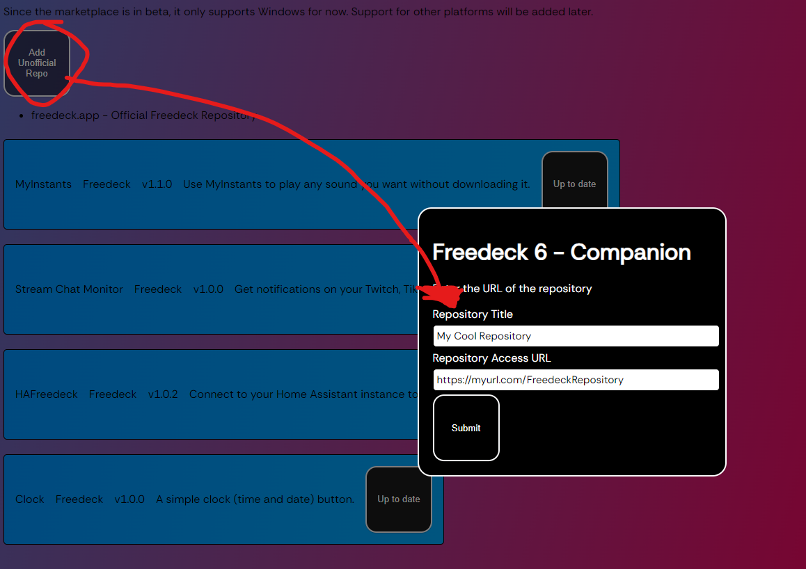

# marketplace-repository-php

## Slightly Deprecated Method

This method is still, and will continue to be supported by Freedeck **COMPANION** (NOT THE LAUNCHER) until it's full release.  
Until documentation, or a help repository is made, you may view [releases.freedeck.app/index.json](https://releases.freedeck.app/index.json) 's file to understand how Repository v2 works.

## Anyways...

This is the official unofficial Marketplace repository script!
All you need to do is throw "repository.php" in a folder, setup your downloads (can be in downloads folder if you wish), then add to Freedeck!

## Example

Let's say you own `myurl.com`, and want a freedeck repository at `https://myurl.com/FreedeckRepository`. You'd throw your downloads and repository.php folder in there, then add it to Freedeck like so:

**Do not use a trailing slash!**
